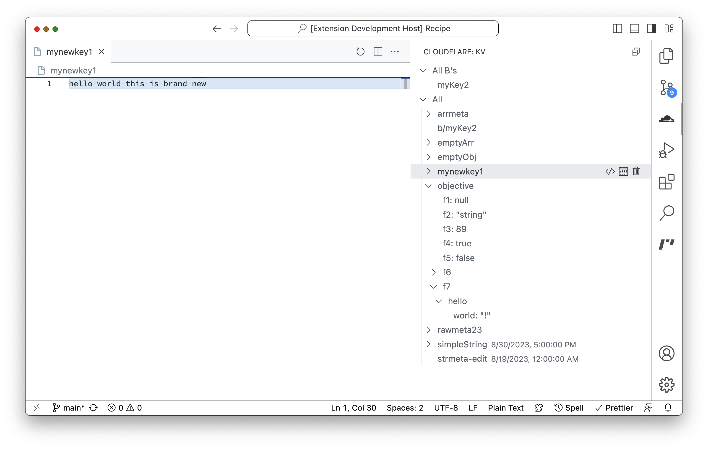

# Cloudflare DevTools for VSCode (unofficial)

Interface wth Cloudflare KV from within VS Code.

Note: wrangler must be installed and logged into for this extension to work.

## Features

- Run and save queries against both remote and local KV stores
  > **_Note_**: Local mode is under development and requires setting the `cloudflare-devtools.wranglerPath` to a local build or hosted npx package. There are bugs.
- {Read, write, put, and delete} {keys, values, metadata, and expirations} for all KV entries.
- Heavy caching to reduce unneeded list and get operations



## Config

- `cloudflare-devtools.kv.queries`: Controls which queries are shown in the View. Note: your `wrangler.toml` ID's are likely out of sync with the true ID's as set on the Web UI. When in doubt, use the Web ID's values (except when doing local developement).

```json
  "cloudflare-devtools.kv.queries": [
    {
      "namespace": {
        "id": "87c6f42b7317412eaaed265226e88217",
        "local": true
      },
      "prefix": "items/",
      "title": "All Items"
    },
    {
      "namespace": {
        "binding": "STORE",
        "local": true
      },
      "title": "Local STORE"
    },
    {
      "namespace": {
        "binding": "STORE",
        "preview": true
      },
      "title": "Remote preview STORE"
    },
    ...
```

- `cloudflare-devtools.wranglerPath`: Command to run for executing wrangler.
  - For instance, using `npx https://prerelease-registry.devprod.cloudflare.dev/workers-sdk/runs/5725468543/npm-package-wrangler-3684` will allow you to test local mode against the [PR's implementation](https://github.com/cloudflare/workers-sdk/pull/3684).
  - Alternatively, `node /some/path/to/wrangler-dist/cli.js` will allow you to use a local build of wrangler.

## Known Issues

- Local mode does not properly render JSON as a parsed value. [View Bug](https://github.com/cloudflare/workers-sdk/issues/3715)
- Local mode does not properly respect prefix filtering. [View Bug](https://github.com/cloudflare/workers-sdk/issues/3716)
